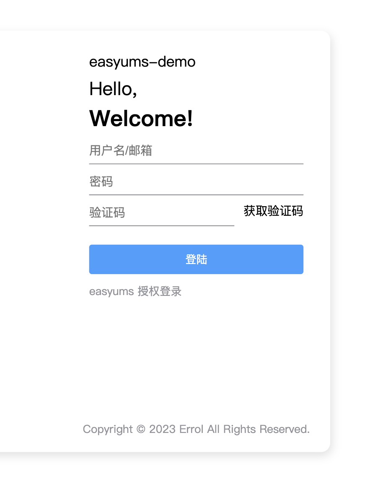
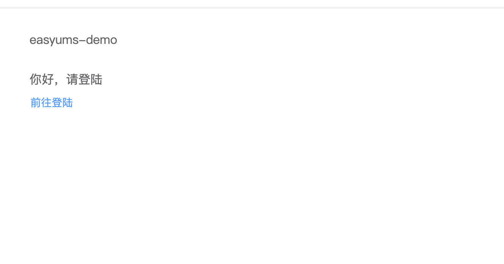
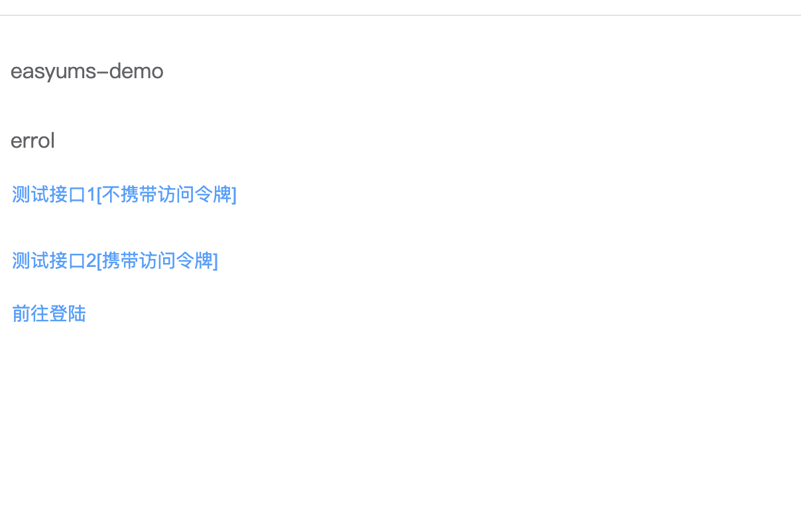

# EASYUMS-DEMO

easyums授权系统对接示例。

## 启动

1、easyums

当前示例代码需要依赖[easyums](https://github.com/xxzhiwei/easyums)，启动easyums后，将数据库中的客户端id、密钥、回调地址拷贝到指定位置（按需注册客户端）。

如有疑惑，请先查看easyums的项目说明。

> https://github.com/xxzhiwei/easyums

1.1、拷贝至easyums-demo/server

以下代码是在同一文件中。

1）id&secret

> server/src/service/oauthService.js

```js
// ...
const clientId = 2;
const clientSecret = "easyums@demo1";
// ...
```

2）回调地址

> server/src/service/oauthService.js

```js
const resp = await axios({
    // ...
    data: {
        grant_type: "authorization_type",
        code: code,
        client_id: clientId,
        redirect_uri: 'http://localhost:8887/#/oauth2/callback'
    }
});
```

1.2、拷贝至easyums-demo/web

只需要客户端id，以下代码是在同一文件中。

1）id&secret

> web/src/views/login.vue

```js
// ...
const authorizationUrl = encodeURI(`http://localhost:8084/oauth2/authorize?redirect_uri=${redirectUrl}&client_id=2&response_type=code&state=1&scope=openid profile email`);
// ..
```

2）回调地址

> web/src/views/login.vue

```js
// ..
const redirectUrl = encodeURIComponent('http://localhost:8887/#/oauth2/callback');
// ..
```

（事实上集成在一个配置文件中更合适）

2、easyums-demo

本系统又分为前后端两个部分，需要分别进行启动。

2.1、web

web端主要包含了三个页面，分别为登陆、注册、home。



*图1 用户登陆*


*图2 用户注册*



*图3 主页（未登录）*



*图4 主页（已登录）*

在当前，使用该网页的目的是为了成功调用home页面中的"/test/1"接口，如下所示：


*图5 测试接口2*

点击该按钮，并得到"ok"的提示字样时，表示调用成功。

当然，对于首次使用系统的用户来说，在成功调用接口之前，还需要经过一系列的步骤。

该流程可以简单概括为：

> easyums-demo -> 跳转 -> easyums -> 认证(按需注册) -> 跳转 -> easyums-demo -> (按需注册) -> 授权登录成功

在上述的流程中，对于首次使用系统的用户来说，需要分别在easyums和easyums-demo系统中注册账号，即除了oauth授权服务器之外，第三方应用也有自己的用户体系，而不是赖于授权服务器。

> 第三方应用只是从授权服务器中获取了用户的数据，并为用户在自己的系统上注册了一个账号，该账号与授权服务器的账号关联。

oauth的统一登陆（或者也可以说是单点登录）就是靠这个关联关系实现的。

```bash
cd web

# 安装依赖；已安装可跳过
npm i

npm run dev
```

2.2、server

创建数据库，并执行"server/demo1.sql"文件后，根据自己的情况修改数据库连接配置信息"server/src/config/dbHelper.js"，最后终端执行以下命令启动服务端。

```bash
cd server

npm i

# 赋予权限
chmod u+x bin/www

bin/www
```

3、以上步骤完成后，在浏览器打开web端

> http://localhost:8887